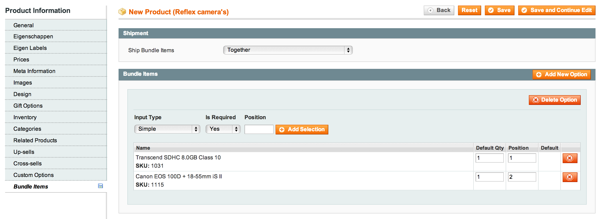
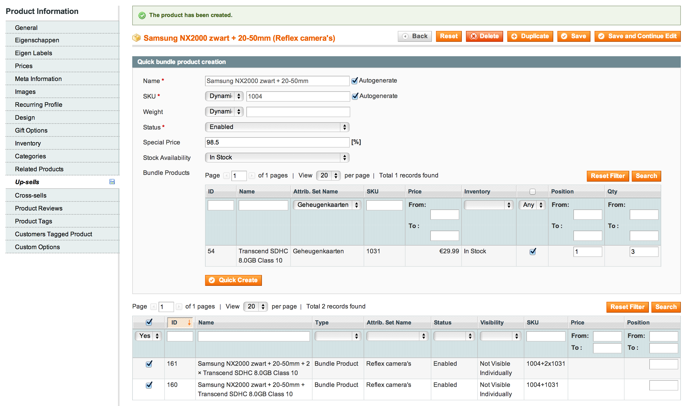
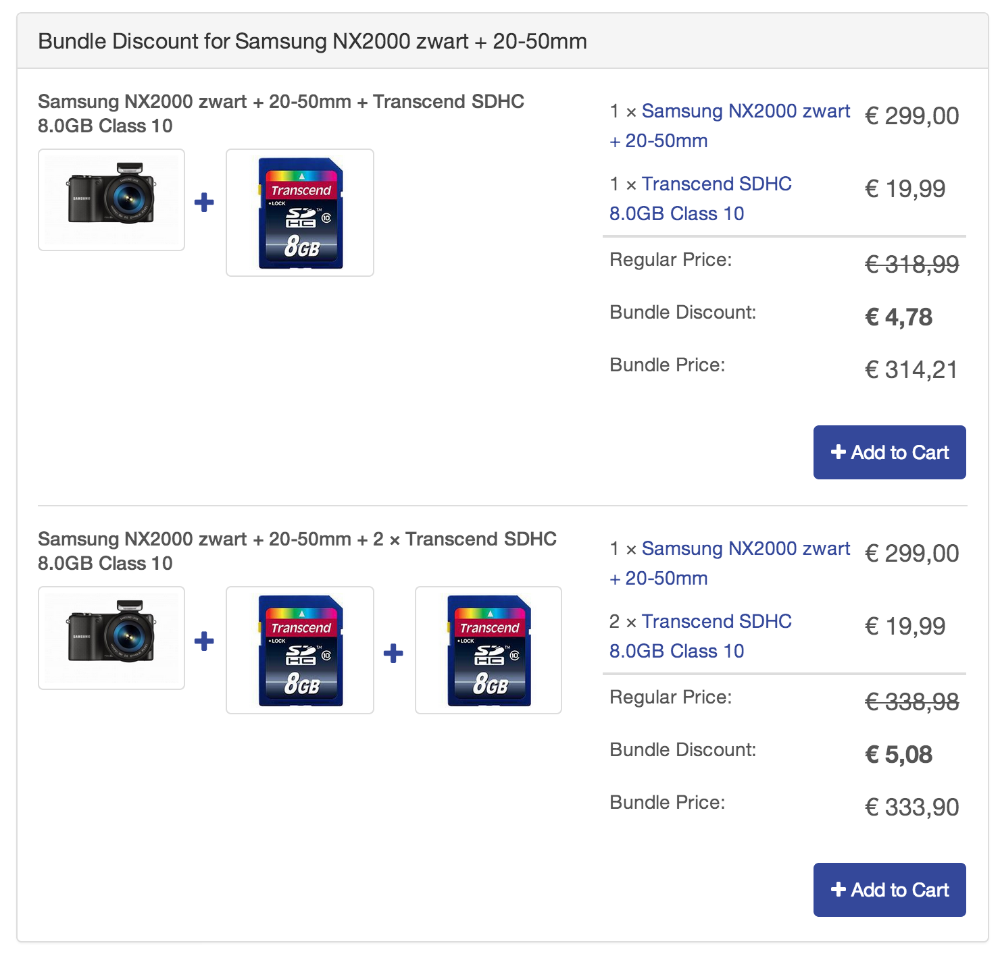

#H&O Simple Bundle

Create bundles that don't have any options to choose from and are simple to create.

## Known Issue:
At this moment it is not possible to use simple bundles standalone. All simple bundles are automatically set to 'Not visisble individually'. This is due to a problem with the indexers, the simple bundles need to have their prices indexed differently for the prices to be properly set in the grid. Also the bundle product-page shows the wrong prices. If this is fixed we can also allow bundle products in the grid.

## Screenshots:

### Create bundles, single option

### Quick create bundles in upsell section of product:

### Frontend example product page:

### About us
We at H&O build high quality [magento webshops](https://www.h-o.nl/magento-webshops) with a focus on technique. We like sharing our knowledge and interacting with the magento community and making e-commerce even greater.
